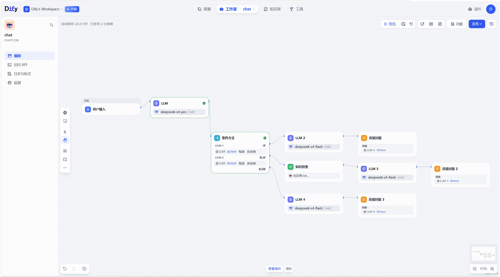

# Agent 学习执行完成情况

> 最后更新：2026-05-16
> 对照计划：`18天Agent学习冲刺计划.md`

---

## 当前进度总览

| 维度 | 已完成 | 待完成 | 进度 |
|------|--------|--------|------|
| 📖 教程阅读 | Ch1-Ch4 + Ch6 + Dify/Coze文档（Ch5半完成） | Ch5补完 | 7/16 |
| 💻 代码学习 | Day1 核心代码 | day01补充 + day02代码 + supplement末尾对比表 | 6/9 |
| 📝 LeetCode | 15题 | 42题 | 15/57 |
| 📖 八股背诵 | 第1章(5题)已背 + 第5章(9题)已过未熟 | 第5章巩固背诵 + 第2-4/6-15章 | 14/75 |

---

## Day1（5/13）完成情况

### 📖 阅读

| # | 章节 | 路径 | 阅读程度 |
|---|------|------|----------|
| 1 | 第一章 初识智能体 | `hello-agents/docs/chapter1/第一章 初识智能体.md` | ⚡ 快速浏览 |
| 2 | 第二章 智能体发展史 | `hello-agents/docs/chapter2/第二章 智能体发展史.md` | ⚡ 快速浏览 |
| 3 | 第三章 大语言模型基础 | `hello-agents/docs/chapter3/第三章 大语言模型基础.md` | ⚡ 快速浏览 |
| 4 | 第四章 智能体经典范式构建 | `hello-agents/docs/chapter4/第四章 智能体经典范式构建.md` | ⭐ 精读，所有代码全部看懂 |

**阅读程度说明：** ⚡快速浏览 / ⭐精读

### 💻 代码

| # | 内容 | 路径 | 状态 |
|---|------|------|------|
| 1 | Plan-Solve + Reflection 范式（DeepSeek适配版）| `daily_exercises/supplement_01_agent_paradigms.py` | ✅ 完成 |
| 2 | VideoCode ReAct（类封装+XML标签+参数解析器）| `VideoCode/Agent的概念、原理与构建模式/agent.py` | ✅ 完成 |
| 3 | VideoCode Prompt模板 | `VideoCode/Agent的概念、原理与构建模式/prompt_template.py` | ✅ 完成 |
| 4 | hello-agents 原版 ReAct | `hello-agents/code/chapter4/ReAct.py` | ✅ 完成 |
| 5 | hello-agents LLM客户端封装 | `hello-agents/code/chapter4/llm_client.py` | ✅ 完成 |
| 6 | hello-agents 工具执行器 | `hello-agents/code/chapter4/tools.py` | ✅ 完成 |

### 📝 LeetCode（4题）

| # | 题号 | 题目 | 难度 | 考点 | 状态 |
|---|------|------|------|------|------|
| 1 | 19 | 删除链表的倒数第N个结点 | 中等 | 快慢指针 | ✅ 完成 |
| 2 | 121 | 买卖股票的最佳时机 | 简单 | 贪心/DP | ✅ 完成 |
| 3 | 124 | 二叉树中的最大路径和 | 困难 | 树形DP | ✅ 完成 |
| 4 | 128 | 最长连续序列 | 中等 | 哈希 | ✅ 完成 |

### 📖 八股（第1章 5题）

| # | 内容 | 来源 | 状态 |
|---|------|------|------|
| Q1-1 | RAG和微调的核心区别？能不能一起用？ | 题库 Q1-1 | ✅ 已背诵 |
| Q1-2 | 什么是AI Agent？和传统AI应用区别 | 题库 Q1-2 | ✅ 已背诵 |
| Q1-3 | 什么时候用Prompt/RAG/微调/Workflow/Agent？ | 题库 Q1-3 | ✅ 已背诵 |
| Q1-4 | Token和上下文窗口是什么？工程意义？ | 题库 Q1-4 | ✅ 已背诵 |
| Q1-5 | 大模型应用上线前最关心哪些工程指标？ | 题库 Q1-5 | ✅ 已背诵 |

---

## Day2（5/14）完成情况

### 📖 阅读

| # | 章节 | 路径 | 阅读程度 |
|---|------|------|----------|
| 1 | 第五章 低代码平台搭建 | `hello-agents/docs/第五章 基于低代码平台的智能体搭建.md` | ⚠️ 半完成（图片链接绝大部分加载不出来，未跟着搭建） |
| 2 | Python调用Dify平台工作流 | `ai-agents-from-zero/4-Python调用Dify平台工作流.md` | ❌ → ✅ 5/15 Day3 已看 |
| 3 | Python调用Coze平台工作流 | `ai-agents-from-zero/5-Python调用Coze平台工作流.md` | ❌ → ✅ 5/15 Day3 已看 |
| 4 | 第六章 框架开发实践 | `hello-agents/docs/第六章 框架开发实践.md` | ❌ → ✅ 5/16 Day4 已全部看完 |
| 5 | 低代码平台动手文档 | `daily_exercises/day03_Coze_Dify平台动手.md` | ❌ → ✅ 5/15 Day3 已看 |

### 💻 代码

| # | 内容 | 路径 | 状态 |
|---|------|------|------|
| 7 | EasyAgent代码精读（对照阅读）| `daily_exercises/day01_大模型认知与EasyAgent精读.md` | ❌ 未做（80%内容已覆盖，快速过一遍即可） |
| 8 | 多工具Agent调度（主练）| `daily_exercises/day02_多工具Agent练习.py` | ❌ 未做 |
| 9 | 三种范式对比总结（末尾对比表）| `daily_exercises/supplement_01_agent_paradigms.py`（末尾） | ❌ 未做 |

### 📝 LeetCode（4题）

| # | 题号 | 题目 | 难度 | 考点 | 状态 |
|---|------|------|------|------|------|
| 5 | 136 | 只出现一次的数字 | 简单 | 位运算 | ✅ 完成 |
| 6 | 139 | 单词拆分 | 中等 | DP | ✅ 完成 |
| 7 | 141 | 环形链表 | 简单 | 快慢指针 | ✅ 完成 |
| 8 | 142 | 环形链表II | 中等 | 快慢指针+数学 | ✅ 完成 |

### 📖 八股（第5章 9题，已过一遍未熟练）

| # | 内容 | 来源 | 状态 |
|---|------|------|------|
| Q5-1 | ReAct模式是什么？（含CoT区别追问） | 题库 Q5-1 | ⚠️ 已过，不熟练 |
| Q5-2 | Tool/FC/Agent三者关系？（含追问） | 题库 Q5-2 | ⚠️ 已过，不熟练 |
| Q5-3 | Agent核心组件构成？（含挑战追问） | 题库 Q5-3 | ⚠️ 已过，不熟练 |
| Q5-4 | Function Calling基本原理 | 题库 Q5-4 | ⚠️ 已过，不熟练 |
| Q5-5 | 设计Tool的工程原则 | 题库 Q5-5 | ⚠️ 已过，不熟练 |
| Q5-6 | "查天气、查新闻"AI助手怎么设计？ | 题库 Q5-6 | ⚠️ 已过，不熟练 |
| Q5-7 | 什么是"工具幻觉"？怎么缓解？ | 题库 Q5-7 | ⚠️ 已过，不熟练 |
| Q5-8 | Function Calling和"输出JSON再解析"的区别？ | 题库 Q5-8 | ⚠️ 已过，不熟练 |
| Q5-9 | 工具很多时怎么控制上下文长度和调用稳定性？ | 题库 Q5-9 | ⚠️ 已过，不熟练 |

---

## Day3（5/15）完成情况

### 💻 Dify 动手

| # | 内容 | 状态 |
|---|------|------|
| 1 | Dify 搭建"客服分类Agent" Chatflow | ✅ 已完成 |
| 2 | 用 Python 调用 Dify 工作流代码 | ❌ → ✅ 5/15 Day3 已看懂（未实跑，需API Key） |
| 3 | 在 Coze 上搭建同样功能的 Bot | ⏸ 未做 |
| 4 | Python 调用 Coze Bot API代码 | ❌ → ✅ 5/15 Day3 已看懂（未实跑，需API Key） |

**截图：**

完成的 Dify 截图：

### 📖 阅读（Day3 新任务）

| # | 内容 | 状态 |
|---|------|------|
| 1 | LangChain概述 + 快速上手 + Model I/O + 提示词模板 | ❌ 未看 |

### 💻 代码（Day3 新任务）

| # | 内容 | 状态 |
|---|------|------|
| 1 | `day04_LangChain重写Agent.py` | ❌ 未做 |

### 📝 LeetCode（Day3 新任务）

| # | 题号 | 题目 | 状态 |
|---|------|------|------|
| 9 | 146 | LRU缓存 | ❌ → ✅ 5/16 Day4 完成 |
| 10 | 148 | 排序链表 | ❌ 未做 |
| 11 | 152 | 乘积最大子数组 | ❌ → ✅ 5/16 Day4 完成 |
| 12 | 155 | 最小栈 | ❌ → ✅ 5/16 Day4 完成 |

### 📖 八股（Day3 新任务）

| # | 内容 | 状态 |
|---|------|------|
| 1 | 第3章 RAG入门 + 第4章检索基础（5题） | ❌ 未做 |

---

## Day4（5/16）完成情况

### 📖 阅读

| # | 章节 | 路径 | 阅读程度 |
|---|------|------|----------|
| 1 | 第六章 框架开发实践 | `hello-agents/docs/第六章 框架开发实践.md` | ✅ 全部看完 |

### 📝 LeetCode（7题）

| # | 题号 | 题目 | 难度 | 考点 | 状态 |
|---|------|------|------|------|------|
| 1 | 146 | LRU缓存 | 中等 | 哈希+双向链表 | ✅ 完成 |
| 2 | 152 | 乘积最大子数组 | 中等 | DP | ✅ 完成 |
| 3 | 155 | 最小栈 | 中等 | 栈设计 | ✅ 完成 |
| 4 | 160 | 相交链表 | 简单 | 双指针 | ✅ 完成 |
| 5 | 169 | 多数元素 | 简单 | Boyer-Moore投票 | ✅ 完成 |
| 6 | 198 | 打家劫舍 | 中等 | DP | ✅ 完成 |
| 7 | 200 | 岛屿数量 | 中等 | DFS/BFS | ✅ 完成 |

---

## 📊 累计统计

- **LeetCode 四刷完成：58/100 题**（此前已完成 43 题 + Day1 4题 + Day2 4题 + Day3 0题 + Day4 7题）
- **八股背诵：14/75 题**（第1章5题已背 + 第5章9题已过未熟）

---

